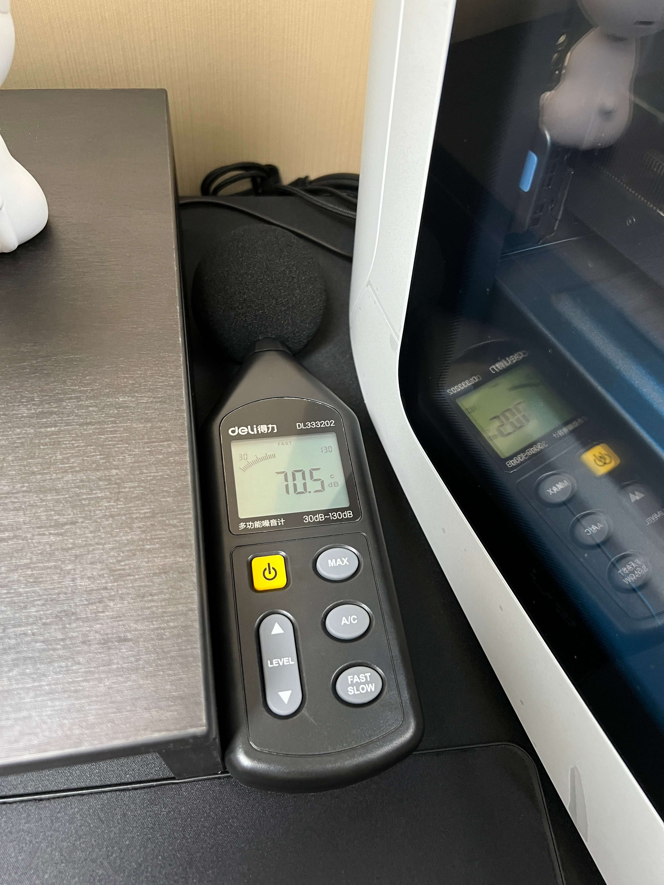
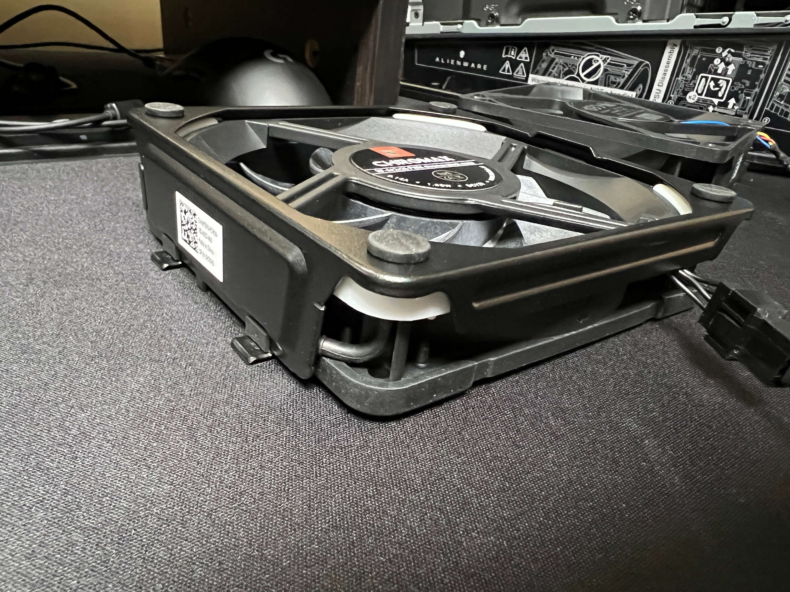

# Alienware-Aurora-R13-Water-Cooling

外星人R13主机外置压缩机水冷改装分享

## 起因

先说说由来吧, 我上一个主机是自己组装的 M8I + i7 6700K + GTX1080, 2016年8月份左右, 距今也差不多6年了, 正巧玩`永劫无间`, 游戏优化拉胯, 导致经常60帧到90帧之间跳来跳去, 野外溜达90帧, 附近有人的时候马上60帧 活活的"小雷达", 天人城有三队 那基本上就是60帧以下了, 体验非常糟糕, 一直忍着打到拾月.

恰逢双十一 12代刚刚发布 i9 12900K 看起来非常给力, 于是琢磨是时候该换一套了.

首发的主板和CPU着实难抢, 也恰巧这时候外星人R13发布了, 这一代的外观实在是长在我审美上了(加之我一直对ROG的杀马特灯不感冒), 最终还是没忍住下手了.

其实正常来说新上市的产品应该等等评测之类的, 免得成了小白鼠, 但是外星人的评测简直太少了, 加之我又等不及, 所以这个小白鼠我当定了.

## 问题

众所周知 外星人祖传120冷排已经传承了N代, 对于日常中度使用的用户来说吧, 也只是刚刚够用, 相传外星人的120有魔法, 咱也没用过其他120冷排, 没有数据来论证到底有多大差距.

日常各种3A和永劫无间等游戏, CPU温度大致在70度左右, 显卡满载在79度左右(显存96度上下).

其实这些温度对于一个顶级CPU和350W的显卡来说 还算压得住吧, 刚刚好压住了的感觉 (DELL的设计师真的精打细算啊).

但是大家可能忽略了一点, 70度的CPU, 对于一个120的水冷是需要一个差不多3000转的风扇满速运行才能保持住的水平, 满速!!! 那噪音, 我的天, 我家里仿佛有台喷气飞机...

为了验证这个噪音是如此之大 我特意买了一个测音器 (设置了C加权 较A加权大约高出8分贝左右 仅供参考):

日常待机分贝:

`永劫无间`时的噪音分贝:

`永劫无间`时近距离的噪音分贝:

AWCC风扇拉满的噪音分贝:

可以看到, 这噪音恐怖如斯, 严重影响日常使用, 那么有人会问了: "机箱放到桌子下面 会不会好一些呢?" 

摆脱~ 都买外星人了, 还放到看不到的地方, 那我为什么不买个普通的主机呢? 对吧.

## 尝试解决

### 解决方案一: 更换猫头鹰风扇

通过各种论坛的搜索和研究, 最终在小红书上发现了一位博主, 他写了几篇关于外星人R13的分享, 其中就有关于更换原厂风扇的文章, 仔细阅读并交流后, 我觉得可以尝试一下.

于是乎, 打开了淘宝 放血🩸 直接一步到位 NOCTUA NF-A12X15 PWM * 3:

准备拆风扇! 先看一下原厂风扇

顶部一个

.JPG)

前面两个

.JPG)

顺便看一眼细节, 风扇是通过胶钉固定在支架上的, 直接可以免工具安装在机箱内, 这个设计真是方便👍🏻

.JPG)

更换完成!

安装上去!

.JPG)

.JPG)

大功告成, 迫不及待的试试结果吧!

emmmm...... 有效果, 但不完全有. 

.JPG)

.JPG)

血亏!!!! 

### 解决方案二: 更换硅脂导热垫

