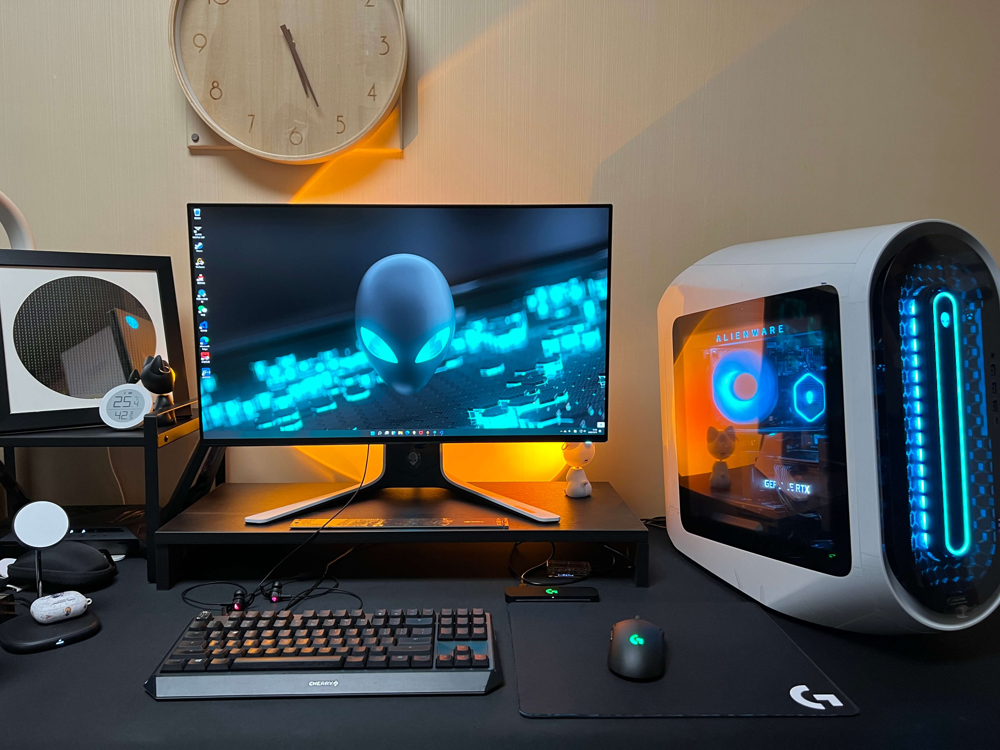

# Alienware-Aurora-R13-Water-Cooling

外星人R13主机外置压缩机水冷改装分享

## 前言

先说说由来吧, 我上一个主机是自己组装的 M8I + i7 6700K + GTX1080, 2016年8月份左右, 距今也差不多6年了, 正巧玩`永劫无间`, 游戏优化拉胯, 导致经常60帧到90帧之间跳来跳去, 野外溜达90帧, 附近有人的时候马上60帧 活活的"小雷达", 天人城有三队 那基本上就是60帧以下了, 体验非常糟糕, 一直忍着打到食月.

恰逢双十一 12代发布了 i9 12900K 非常给力, 于是琢磨是时候该换一套了.

首发的主板和CPU着实难抢, 也恰巧这时候外星人R13发布了, 外观实在长在我审美上了(我一直对ROG的杀马特灯不感冒)
